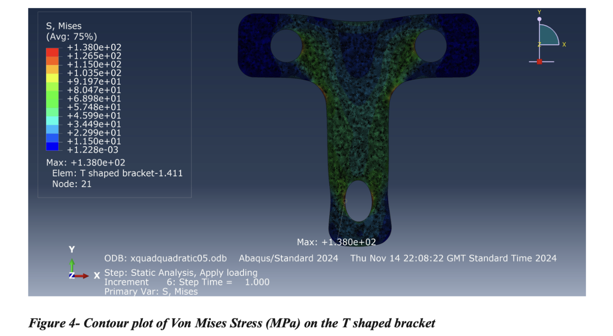
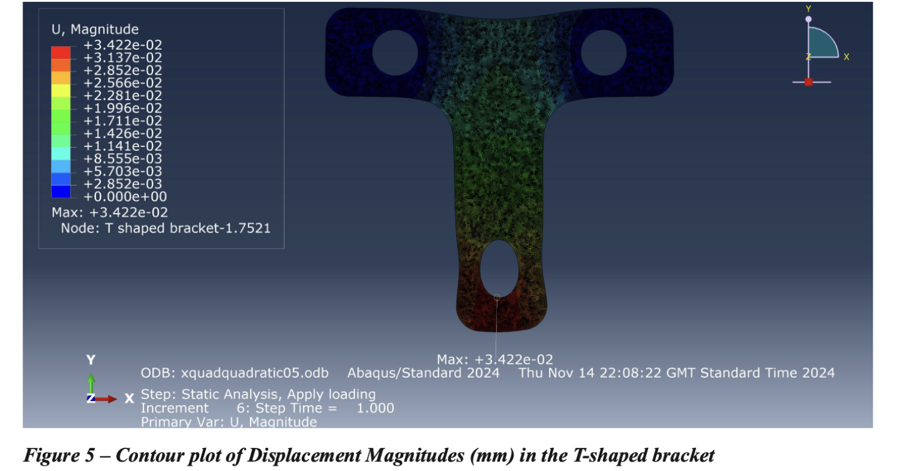
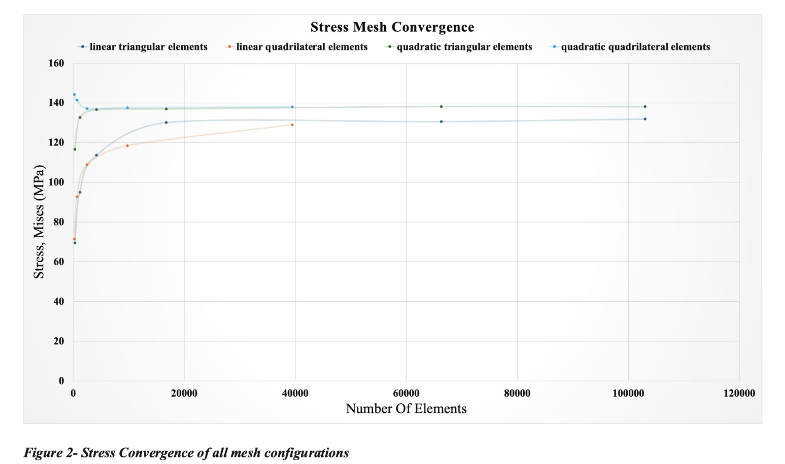

# Finite Element Analysis – T-Bracket

## Overview

Finite Element Analysis project investigating the structural performance of a 2D T-shaped mild-steel bracket under an applied load using Abaqus.

## Project Aim

The project aimed to assess the stress and displacement behaviour of the bracket and investigate how mesh refinement and element type affect the accuracy and convergence of the finite element solution.

## My Work

I:

- Developed a 2D plane-stress model of a T-shaped bracket in Abaqus
- Applied appropriate material properties, boundary conditions and loading
- Investigated stress and displacement distributions across the bracket
- Examined stress concentrations around bolt holes and filleted regions
- Performed mesh convergence analysis using different element types and refinement levels
- Compared linear and quadratic polynomial basis functions
- Evaluated the effect of mesh refinement on solution accuracy
- Interpreted the results to identify the most reliable simulation configuration
## Project Visuals

### Von Mises Stress Distribution

Contour plot showing the distribution of Von Mises stress across the T-shaped bracket under the applied loading condition, with the highest stress concentrations occurring around the bolt holes and filleted edges.

### Displacement Distribution

Contour plot showing the displacement magnitude across the bracket, with the greatest displacement occurring around the loaded bottom bolt hole.

### Stress Mesh Convergence

Stress convergence across the different mesh configurations, demonstrating the effect of mesh refinement and element selection on the reliability of the FEA solution.

## Key Findings

The analysis identified the highest stress concentrations around the bolt holes and filleted edges, with the maximum stress occurring at the bottom bolt hole where the load was applied.

Mesh refinement improved the stability and accuracy of the simulation. The results converged towards approximately **138 MPa stress** and **0.0342 mm displacement**, with **quadratic quadrilateral elements** providing the most consistent and reliable convergence.

The results demonstrate the importance of both mesh refinement and element selection when producing reliable finite element simulations.

## Methods

- Finite Element Analysis
- Structural simulation
- Mesh refinement
- Mesh convergence analysis
- Stress analysis
- Displacement analysis
- 2D plane-stress modelling

## Software

- Abaqus

## Skills Demonstrated

- Finite Element Analysis
- Numerical modelling
- Structural analysis
- Engineering simulation
- Mesh convergence
- Quantitative analysis
- Problem solving
- Technical interpretation
- Engineering reporting

## Project Materials

- [View Project Report](./finite-element-analysis-t-bracket-report.pdf)
